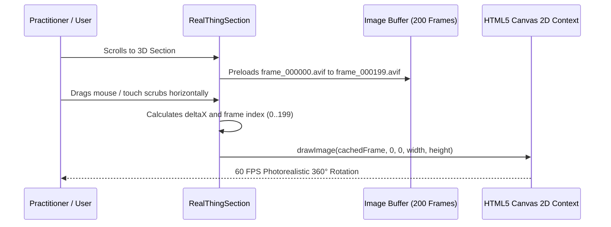

# 03. Interactive Features & 3D Customizer

## 1. 3D Frame Rotation Player (`RealThingSection.tsx`)

Rather than relying on heavy WebGL engines or complex three.js runtimes that consume massive battery and stutter on mobile devices, **The Divine Lotus** implements an ultra-smooth, lightweight **200-frame Canvas sequential rotation player**.

### Architectural Advantages
- **60 FPS guaranteed**: Direct GPU rasterization to an HTML5 `<canvas>`.
- **Zero WebGL overhead**: Instant loading without shader compilation spikes.
- **Full cross-device compatibility**: Identical performance on iOS Safari, Android Chrome, and Desktop browsers.



---

## 2. Scrub & Gesture Mechanics

- **Horizontal Touch & Drag**: Dragging across the viewport calculates horizontal delta with velocity damping.
- **Scroll Synchronization**: Smooth wheel events increment or decrement rotation with inertia.
- **Autoplay Orbit**: When idle, the player gently orbits through the 200 frames at a meditative 24 fps, pausing automatically upon pointer interaction.

```ts
// Frame Calculation Logic
const handleDrag = (clientX: number) => {
  const deltaX = clientX - startX.current;
  const frameDelta = Math.floor(deltaX / sensitivity);
  const nextFrame = (startFrame.current + frameDelta) % 200;
  setCurrentFrame(nextFrame < 0 ? nextFrame + 200 : nextFrame);
};
```

---

## 3. Product Customizer Modal (`CustomizeModal.tsx`)

The bespoke customizer allows practitioners to preview and order tailored iterations of The Lotus Seat:

### Features
1. **Pre-curated Organic Palettes**:
   - Slate Mist (`#767D85`)
   - Terracotta Rose (`#B56764`)
   - Ochre Gold (`#CBB18D`)
   - Warm Taupe (`#B28C73`)
   - Sapphire (`#72B0AB`)
   - Pistachio (`#B89D47`)
2. **Custom Hex Tone Picker**: Allows practitioners to specify bespoke hex codes for both the base cork perimeter and velvet upper.
3. **Smart Fabric Matcher**: Practitioners can upload photos of their meditation space or sacred altar textiles; a canvas-based client-side color extractor analyzes dominant tones and applies them to the seat model.
4. **Gold Monogram & Embroidery**: Options to add custom sacred geometry symbols (Flower of Life, Sri Yantra, Om) or personal initials.
